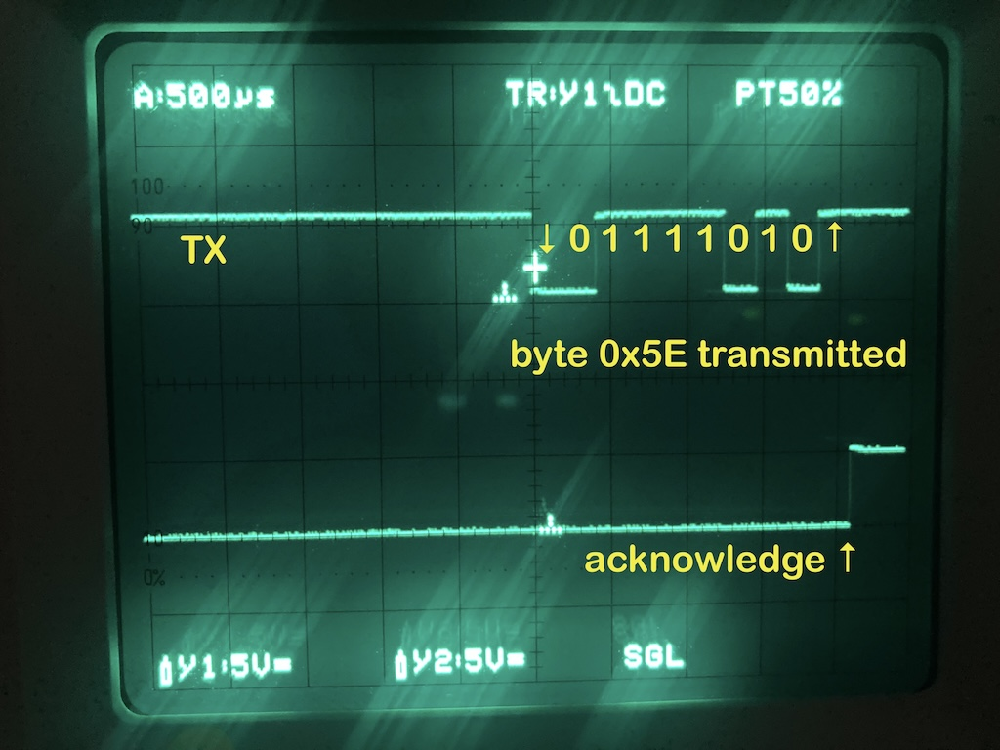
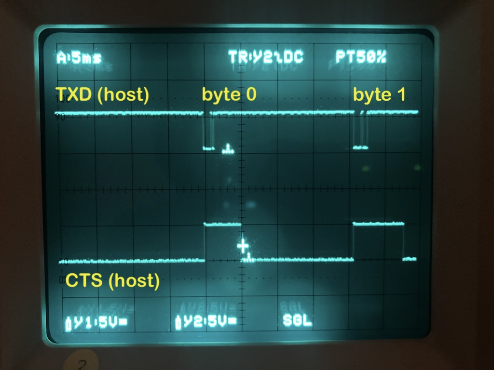
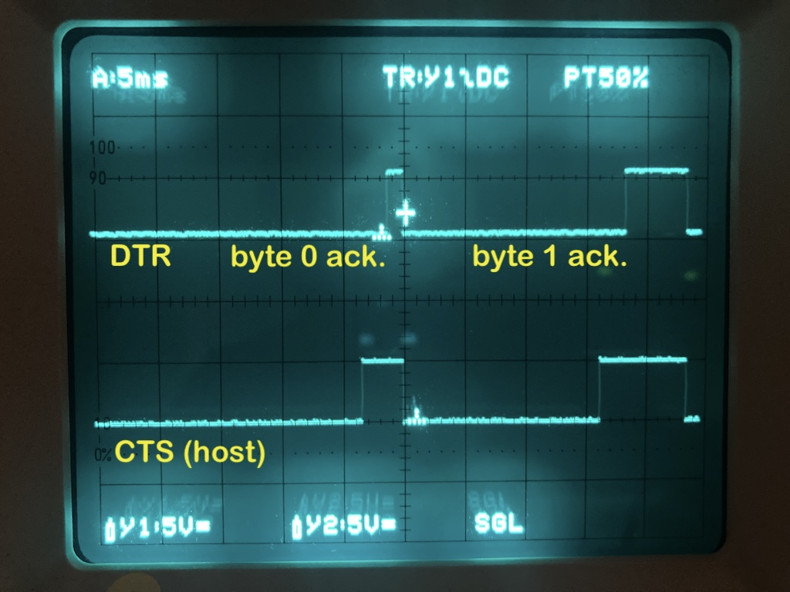

## Data transfer between typewriter and the host computer 

### USB interface?

To connect the typewriter to your computer a general-purpose USB-UART adapter with TTL level (5 Volts) is needed.
For example, one based on FT232RL chip, which is also used to develop this project.

If the one is available which can be powered from the external source, the Ppp +5 pin from the typewriter can be
supplying power to the chip's circuits.

The typewriter provides a 8-pin DIN connector. Be aware of +35 Volts and +10 Volt pins presence:
a high voltage can damage the electronic components if these pins are connected.

#### Wiring diagram

| USB-UART adapter pins | purpose, direction | typewriter I/O pins  |
|-----------------------|--------------------|----------------------|
| `GND`                 | ground             | `GND`                |
| `VCCIO`               | `+` power          | `+5V`                |
| `RXD`                 | `<-`               | `TXD`                |
| `TXD`                 | `->`               | `RXD`                |
| `CTS#`                | `<-` *read below*  | `DTR`                |
| `RTS#`                | `->`               | `DSR`                |
| not connected         | not connected      | `+10V`  ⚠️           |
| not connected         | not connected      | `+35V`  ⚠️           |

### Data flow control between the typewriter and host computer

The data flow is controlled via CTS# and RTS#  signals on the host side.
Once a single byte is sent, the host computer waits for a confirmation signal. After each successfully received byte
the typewriter pulls up its DTR pin up for about `1..8` milliseconds:

In q non-realtime operating system environment this short-living signal on `CTS#` line is likely to be missed.
To give the host computer a chance to read the feedback signal we have to keep the state of `CTS`
line for a longer time, until the computer can read the event. 

One solution would be to pull this line high when the data transmission begins and release 
it when the confirmation signal comes. Let's change the signal flow between `DTR` pin of the typewriter and `CTS` pin
on the host-computer side.

1. when a start-bit pulls down the `TX` line, the `CTS` pin is pulled up and latched in high state: 
2. typewriter confirms the data reception pulling its `DTR` line up for about 5 ms. and then down;
3. on the falling edge on `DTR` line we pull down the `CTS` pin (possibly with hysteresis effect): 

### Middleware design considerations

#### Variant with RS trigger, two logic inverters and one NAND gate;

- the latch can be built with one `RS#` flip-flop and two logical inverters;
- it's recommended to use the inverters with hysteresis, for example `SNx4HC14` with Schmitt-trigger inputs;
- `RS#` trigger can be built on a single IC, for example `SNx4HC00` by connecting two 2-input NAND gates together;
- `DTR` pin (on typewriter side) is inverted and then routed to `R#` input;
- `TXD` pin is routed directly to `S#` input;
- `Q` output is inverted and routed to NAND gate;
- the second input of NAND gate is connected to `R#`;
- the output of NAND gate is connected to `CTS#` pin of the host computers UART interface (usually UART-to-USB adapter).

#### Variant with four NAND gates

- use `SNx4HC00` or similar IC;
- connect first and second NAND gates together to obtain `RS#` trigger;
- invert the `DTR` pin (using the third NAND as inverter) and then route it to `R#` input;
- route `TXD` pin to `S#` input;
- fourth NAND gate: 2 inputs connect to `RS#` and `Q#` when the output connect to `CTS#` pin on host computer.
